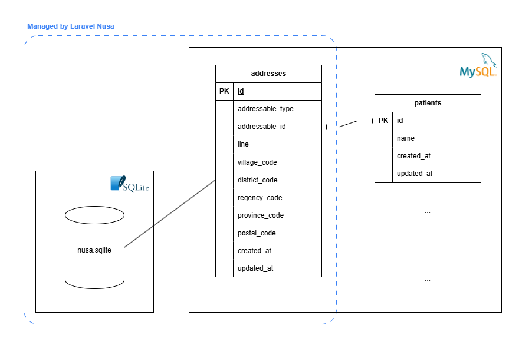

In many business requirements, we usually need address information. This information is typically used to determine customer shipping locations, analyze user distribution by region, or for other business purposes.

Addresses are hierarchical data. In Indonesia, the address structure from largest to smallest is Province, Regency/City, District, and Village/Sub-district. To ensure address storage in the application is consistent and complies with government regulations, we need to use a reliable data source. If you are developing an application using Laravel, you can use [**Laravel Nusa**](https://nusa.creasi.dev/en/).

Laravel Nusa is a package containing Indonesian administrative region data that doesn’t need to be migrated or seeded to use. The data of this package is based on Kepmendagri No 300.2.2-2138 Tahun 2025. This package is quite actively maintained. As of the writing of this article, the last commit for Laravel Nusa was on January 29, 2026.

I recommend you visit the documentation directly, as I think it is very complete. Here, I just want to share my method of using the Laravel Nusa package using Blade templates, Bootstrap 5, and Select2.

## Requirements

These are the technologies used for the code below:

- Laravel 12
- MySQL 8.0
- creasi/laravel-nusa v0.1.16
- Bootstrap 5.3
- Select2 4.0.13
- jQuery 3.7.1

## Objective

In this case, we will act as a clinic manager in Indonesia who needs to store the complete addresses of their patients. One patient has exactly one address. There will be two tables: `patients` and `addresses`. Here is an overview of the system we will create:



Indonesian regional data in the Laravel Nusa package is stored in an SQLite file. You can view the database structure [here](https://github.com/creasico/laravel-nusa/tree/main/database). Since we will use the address management system, we need to migrate the `addresses` table using the migration file provided in the package.

> You can also assign multiple addresses to a single patient if you want. Read more: [Address Management | Laravel Nusa](https://nusa.creasi.dev/en/guide/addresses.html)

Here is what the final result will look like:


## Solution

This section explains the step-by-step process, along with the source code.

### Step 1: Install and prepare the Laravel Nusa package

Enable `pdo_sqlite` and `ext-sqlite3` in your `php.ini` file by removing the semicolon in front of them. This is done because Laravel Nusa works with SQLite.

`php.ini` :

```
...
extension=pdo_sqlite
...

...
extension=sqlite3
...
```

Install the package.

```bash
composer require creasi/laravel-nusa
```

Publish the `addresses` migration file.

```bash
php artisan vendor:publish --tag=creasi-migrations
```

In this version of Laravel Nusa, there is a slight bug in the `addresses` table migration file. The sizes of the `village_code`, `district_code`, and `regency_code` columns do not match the data in SQLite. So, change them to the following size:

```php
Schema::create('addresses', function (Blueprint $table) {
    $table->id();
    $table->nullableMorphs('addressable');
    $table->string('line');
    $table->char('village_code', 13)->nullable(); // 10 -> 13
    $table->char('district_code', 8)->nullable(); // 6 -> 8
    $table->char('regency_code', 5)->nullable(); // 4 -> 5
    $table->char('province_code', 2)->nullable();
    $table->char('postal_code', 5)->nullable();

    $table->timestamps();
});
```

Run the migration.

```bash
php artisan migrate
```

### Step 1.5: About the Indonesian region data endpoint

We will utilize the RESTful API that is automatically created at the `/nusa` endpoint. Read more: [RESTful API | Laravel Nusa](https://nusa.creasi.dev/en/guide/api.html)

### Step 2: Create the Patient entity

Create the model, migration, and controller for the patient entity.

```bash
php artisan make:model Patient -mc
```

`database\migrations\2026_02_11_104009_create_patients_table.php`:

```php
<?php

use Illuminate\Database\Migrations\Migration;
use Illuminate\Database\Schema\Blueprint;
use Illuminate\Support\Facades\Schema;

return new class extends Migration
{
    /**
     * Run the migrations.
     */
    public function up(): void
    {
        Schema::create('patients', function (Blueprint $table) {
            $table->id();
            $table->string('name', 100);
            $table->timestamps();
        });
    }

    /**
     * Reverse the migrations.
     */
    public function down(): void
    {
        Schema::dropIfExists('patients');
    }
};
```

Run the migration.

```bash
php artisan migrate
```

`app\Models\Patient.php` :

```php
<?php

namespace App\Models;

use Creasi\Nusa\Models\Concerns\WithAddress;
use Illuminate\Database\Eloquent\Model;

class Patient extends Model
{
    use WithAddress;

    protected $fillable = [
        'name',
    ];
}
```

`app\Http\Controllers\PatientController.php` :

```php
<?php

namespace App\Http\Controllers;

use App\Models\Patient;
use Creasi\Nusa\Models\Province;
use Creasi\Nusa\Models\Village;
use Illuminate\Http\Request;
use Illuminate\Support\Facades\DB;

class PatientController extends Controller
{
    public function index()
    {
        $patients = Patient::with('address.province', 'address.regency', 'address.district', 'address.village')->get();

        return view('patients.index', [
            'patients' => $patients,
        ]);
    }

    public function create()
    {
        $provinces = Province::all();

        return view('patients.create', [
            'provinces' => $provinces,
        ]);
    }

    public function store(Request $request)
    {
        $validatedData = $request->validate([
            'name' => 'required|string|max:100',
            'province_code' => 'required|string|exists:nusa.provinces,code',
            'regency_code' => 'required|string|exists:nusa.regencies,code',
            'district_code' => 'required|string|exists:nusa.districts,code',
            'village_code' => 'required|string|exists:nusa.villages,code',
            'line' => 'required|string',
            'postal_code' => 'required|string|size:5',
        ]);

        // Validate address consistency
        $village = Village::find($validatedData['village_code']);
        if (
            !$village ||
            $village->district_code !== $validatedData['district_code'] ||
            $village->regency_code !== $validatedData['regency_code'] ||
            $village->province_code !== $validatedData['province_code']
        ) {
            return back()->withErrors(['address' => 'Address components are inconsistent.']);
        }

        // Store the data
        DB::transaction(function () use ($validatedData) {
            $patient = Patient::create([
                'name' => $validatedData['name'],
            ]);

            $patient->address()->create([
                'line' => $validatedData['line'],
                'village_code' => $validatedData['village_code'],
                'district_code' => $validatedData['district_code'],
                'regency_code' => $validatedData['regency_code'],
                'province_code' => $validatedData['province_code'],
                'postal_code' => $validatedData['postal_code'],
            ]);
        });

        return redirect()->route('patients.index')->with('success', 'Patient created successfully.');
    }
}
```

### Step 3: Set up routes

`routes\web.php` :

```bash
<?php

use App\Http\Controllers\PatientController;
use Illuminate\Support\Facades\Route;

Route::get('/patients', [PatientController::class, 'index'])->name('patients.index');
Route::get('/patients/create', [PatientController::class, 'create'])->name('patients.create');
Route::post('/patients', [PatientController::class, 'store'])->name('patients.store');
```

### Step 4: Create view files

`resources\views\layouts\main.blade.php` :

```html
<html lang="en">
  <head>
    <meta charset="UTF-8" />
    <meta name="viewport" content="width=device-width, initial-scale=1.0" />
    <meta http-equiv="X-UA-Compatible" content="ie=edge" />
    <title>Indonesian Administrative Region</title>

    <!-- Bootstrap CSS -->
    <link
      href="https://cdn.jsdelivr.net/npm/bootstrap@5.3.8/dist/css/bootstrap.min.css"
      rel="stylesheet"
      integrity="sha384-sRIl4kxILFvY47J16cr9ZwB07vP4J8+LH7qKQnuqkuIAvNWLzeN8tE5YBujZqJLB"
      crossorigin="anonymous"
    />
    <!-- Select2 CSS -->
    <link
      href="https://cdn.jsdelivr.net/npm/select2@4.1.0-rc.0/dist/css/select2.min.css"
      rel="stylesheet"
    />
    <!-- Select2 Bootstrap 5 Theme CSS -->
    <link
      href="https://cdn.jsdelivr.net/npm/select2-bootstrap-5-theme@1.3.0/dist/select2-bootstrap-5-theme.min.css"
      rel="stylesheet"
    />
  </head>

  <body>
    @yield('content')

    <!-- Bootstrap JS -->
    <script
      src="https://cdn.jsdelivr.net/npm/bootstrap@5.3.8/dist/js/bootstrap.bundle.min.js"
      integrity="sha384-FKyoEForCGlyvwx9Hj09JcYn3nv7wiPVlz7YYwJrWVcXK/BmnVDxM+D2scQbITxI"
      crossorigin="anonymous"
    ></script>
    <!-- jQuery -->
    <script
      src="https://cdnjs.cloudflare.com/ajax/libs/jquery/3.7.1/jquery.min.js"
      integrity="sha512-v2CJ7UaYy4JwqLDIrZUI/4hqeoQieOmAZNXBeQyjo21dadnwR+8ZaIJVT8EE2iyI61OV8e6M8PP2/4hpQINQ/g=="
      crossorigin="anonymous"
      referrerpolicy="no-referrer"
    ></script>
    <!-- Select2 JS -->
    <script src="https://cdn.jsdelivr.net/npm/select2@4.1.0-rc.0/dist/js/select2.min.js"></script>

    @stack('scripts')
  </body>
</html>
```

`resources\views\patients\create.blade.php` :

```html
@extends('layouts.main')

@section('content')
    <div class="container">
        <div class="row justify-content-center py-4">
            <div class="col-md-6">
                <h1 class="text-center fs-2 mb-3">Create New Patient</h1>

                @if ($errors->any())
                    <div class="alert alert-danger">
                        <ul class="mb-0">
                            @foreach ($errors->all() as $error)
                                <li>{{ $error }}</li>
                            @endforeach
                        </ul>
                    </div>
                @endif

                <form action="/patients" method="POST">
                    @csrf

                    <div class="mb-3">
                        <label for="name" class="form-label">Name<span class="text-danger">*</span></label>
                        <input type="text" class="form-control @error('name') is-invalid @enderror" name="name"
                            id="name" placeholder="John Doe" value="{{ old('name') }}" required>
                        @error('name')
                            <div class="invalid-feedback">{{ $message }}</div>
                        @enderror
                    </div>

                    <div class="mb-3">
                        <label for="province" class="form-label">Province<span class="text-danger">*</span></label>
                        <select class="form-select @error('province_code') is-invalid @enderror" name="province_code"
                            id="province" required>
                            <option></option>
                            @foreach ($provinces as $province)
                                <option value="{{ $province->code }}"
                                    {{ old('province_code') == $province->code ? 'selected' : '' }}>{{ $province->name }}
                                </option>
                            @endforeach
                        </select>
                        @error('province_code')
                            <div class="invalid-feedback">{{ $message }}</div>
                        @enderror
                    </div>

                    <div class="mb-3">
                        <label for="regency" class="form-label">Regency<span class="text-danger">*</span></label>
                        <select class="form-select @error('regency_code') is-invalid @enderror" name="regency_code"
                            id="regency" required>
                            <option></option>
                        </select>
                        @error('regency_code')
                            <div class="invalid-feedback">{{ $message }}</div>
                        @enderror
                    </div>

                    <div class="mb-3">
                        <label for="district" class="form-label">District<span class="text-danger">*</span></label>
                        <select class="form-select @error('district_code') is-invalid @enderror" name="district_code"
                            id="district" required>
                            <option></option>
                        </select>
                        @error('district_code')
                            <div class="invalid-feedback">{{ $message }}</div>
                        @enderror
                    </div>

                    <div class="mb-3">
                        <label for="village" class="form-label">Village<span class="text-danger">*</span></label>
                        <select class="form-select @error('village_code') is-invalid @enderror" name="village_code"
                            id="village" required>
                            <option></option>
                        </select>
                        @error('village_code')
                            <div class="invalid-feedback">{{ $message }}</div>
                        @enderror
                    </div>

                    <div class="mb-3">
                        <label for="postal_code" class="form-label">Postal Code<span class="text-danger">*</span></label>
                        <input type="text" class="form-control @error('postal_code') is-invalid @enderror"
                            name="postal_code" id="postal_code" placeholder="12345" value="{{ old('postal_code') }}"
                            required>
                        @error('postal_code')
                            <div class="invalid-feedback">{{ $message }}</div>
                        @enderror
                    </div>

                    <div class="mb-3">
                        <label for="line" class="form-label">Address Line<span class="text-danger">*</span></label>
                        <textarea class="form-control @error('line') is-invalid @enderror" name="line" id="line"
                            placeholder="Jl. Example No.123" rows="3" required>{{ old('line') }}</textarea>
                        @error('line')
                            <div class="invalid-feedback">{{ $message }}</div>
                        @enderror
                    </div>

                    <div class="d-flex justify-content-between">
                        <a href="/patients" class="btn btn-secondary">&larr; Back to Patients List</a>
                        <button type="submit" class="btn btn-primary">Create Patient</button>
                    </div>
                </form>
            </div>
        </div>
    </div>
@endsection

@push('scripts')
    <script src="{{ asset('js/address-form.js') }}"></script>
@endpush
```

`resources\views\patients\index.blade.php` :

```html
@extends('layouts.main') @section('content')
<div class="container">
  <div class="row justify-content-center py-4">
    <div class="col-md-6">
      <h1 class="text-center fs-2 mb-3">Patient List</h1>

      <div class="d-flex justify-content-end mb-3">
        <a href="/patients/create" class="btn btn-primary"
          >Create New Patient</a
        >
      </div>

      <table class="table table-bordered">
        <thead>
          <tr>
            <th>ID</th>
            <th>Name</th>
            <th>Address</th>
          </tr>
        </thead>
        <tbody>
          @foreach ($patients as $patient)
          <tr>
            <td>{{ $patient->id }}</td>
            <td>{{ $patient->name }}</td>
            <td>
              @if ($patient->address) {{ $patient->address->line }}, {{
              $patient->address->village->name }}, {{
              $patient->address->district->name }}, {{
              $patient->address->regency->name }}, {{
              $patient->address->province->name }}, {{
              $patient->address->postal_code }} @else N/A @endif
            </td>
          </tr>
          @endforeach
        </tbody>
      </table>
    </div>
  </div>
</div>
@endsection
```

`public\js\address-form.js` :

```jsx
$(document).ready(function () {
  /* ------------------------------ Configuration ----------------------------- */
  const config = {
    theme: 'bootstrap-5',
    endpoints: {
      regencies: (id) => `/nusa/provinces/${id}/regencies`,
      districts: (id) => `/nusa/regencies/${id}/districts`,
      villages: (id) => `/nusa/districts/${id}/villages`,
    },
    selectors: {
      province: $('#province'),
      regency: $('#regency'),
      district: $('#district'),
      village: $('#village'),
    },
    placeholders: {
      province: '-- Select a province --',
      regency: '-- Select a regency --',
      district: '-- Select a district --',
      village: '-- Select a village --',
    },
  };

  /* ------------------------ Set Select2 default theme ----------------------- */
  $.fn.select2.defaults.set('theme', config.theme);

  /* ---------------- Initialize Select2 on the address fields ---------------- */
  initializeSelect(
    config.selectors.province,
    config.placeholders.province,
    false,
  );
  initializeSelect(config.selectors.regency, config.placeholders.regency, true);
  initializeSelect(
    config.selectors.district,
    config.placeholders.district,
    true,
  );
  initializeSelect(config.selectors.village, config.placeholders.village, true);

  /* ------------------------- Handle Address Changes ------------------------- */
  config.selectors.province.on('change', function () {
    let provinceCode = $(this).val();

    // Reset and disable lower-level selects
    resetSelect(config.selectors.regency, 'Loading...');
    resetSelect(config.selectors.district, config.placeholders.district);
    resetSelect(config.selectors.village, config.placeholders.village);

    // Load regencies based on selected province
    $.ajax({
      url: config.endpoints.regencies(provinceCode),
      method: 'GET',
      success: function (data) {
        $.each(data.data, function (key, value) {
          config.selectors.regency.append(
            '<option value="' + value.code + '">' + value.name + '</option>',
          );
        });
        initializeSelect(
          config.selectors.regency,
          config.placeholders.regency,
          false,
        );
      },
      error: function (xhr, status, error) {
        resetSelect(config.selectors.regency, config.placeholders.regency);
        console.error('Error fetching regencies:', error);
        alert('Failed to load regencies.');
      },
    });
  });

  config.selectors.regency.on('change', function () {
    let regencyCode = $(this).val();

    // Reset and disable lower-level selects
    resetSelect(config.selectors.district, 'Loading...');
    resetSelect(config.selectors.village, config.placeholders.village);

    // Load districts based on selected regency
    $.ajax({
      url: config.endpoints.districts(regencyCode),
      method: 'GET',
      success: function (data) {
        $.each(data.data, function (key, value) {
          config.selectors.district.append(
            '<option value="' + value.code + '">' + value.name + '</option>',
          );
        });
        initializeSelect(
          config.selectors.district,
          config.placeholders.district,
          false,
        );
      },
      error: function (xhr, status, error) {
        resetSelect(config.selectors.district, config.placeholders.district);
        console.error('Error fetching districts:', error);
        alert('Failed to load districts.');
      },
    });
  });

  config.selectors.district.on('change', function () {
    let districtCode = $(this).val();

    // Reset and disable village select
    resetSelect(config.selectors.village, 'Loading...');

    // Load villages based on selected district
    $.ajax({
      url: config.endpoints.villages(districtCode),
      method: 'GET',
      success: function (data) {
        $.each(data.data, function (key, value) {
          config.selectors.village.append(
            '<option value="' + value.code + '">' + value.name + '</option>',
          );
        });
        initializeSelect(
          config.selectors.village,
          config.placeholders.village,
          false,
        );
      },
      error: function (xhr, status, error) {
        resetSelect(config.selectors.village, config.placeholders.village);
        console.error('Error fetching villages:', error);
        alert('Failed to load villages.');
      },
    });
  });

  // Disable submit button on form submit to prevent multiple submissions
  $('form').on('submit', function () {
    $(this).find('button[type="submit"]').prop('disabled', true);
  });
});

function initializeSelect(select, placeholder, isDisabled) {
  select.select2({
    placeholder: placeholder,
    disabled: isDisabled,
  });
}

function resetSelect(select, placeholder) {
  select.html('<option value=""></option>');
  select.select2({
    placeholder: placeholder,
    disabled: true,
  });
}
```

## Result


## Summary

Now you can save Indonesian regional data into your Laravel application. There are still many more cool features from the Laravel Nusa package, such as calculating distances, creating boundaries, and working with coordinates. Please visit their documentation for more information.

Ciao 👋!

## References

[https://nusa.creasi.dev/en/](https://nusa.creasi.dev/en/)
