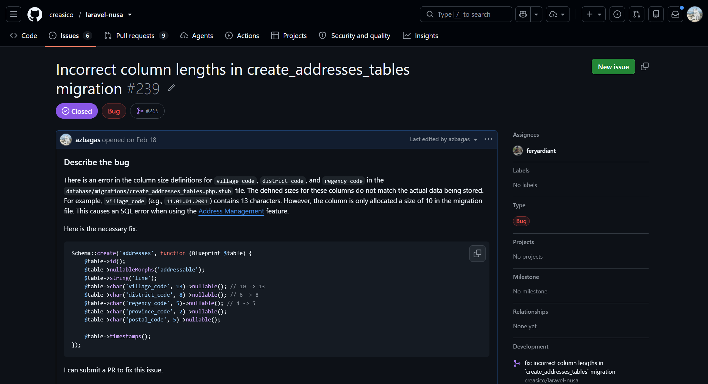

Last February, I was exploring an open-source package designed to handle Indonesian administrative addresses called [Laravel Nusa](https://github.com/creasico/laravel-nusa).

One of its standout features is Address Management. Put simply, this feature seamlessly creates relationships between addresses and users, which will save developers from a complicated initial setup.

It is arguably the package's biggest selling point. The developer even explains how this feature can revolutionize address management in our applications ([Check it out](https://nusa.creasi.dev/en/guide/addresses.html)). A real-world example of its benefit is streamlining the development of e-commerce platforms and multi-location businesses.

## The Bug

Despite its advantages, the feature still harbored a bug.

When I followed the instructions in the documentation under the [Quick Setup (2 Minutes)](https://nusa.creasi.dev/en/guide/addresses.html#quick-setup-2-minutes) section, I ran into an SQL error:

```text
SQLSTATE[22001]: String data, right truncated: 1406 Data too long for column 'village_code' at row 1
```

From this error, it is clear that the value being inserted into the `village_code` column was too long. After checking further, I found that this was not limited to `village_code`; the `district_code` and `regency_code` columns suffered from the exact same issue.

I then took a closer look at how the feature actually works. In short, using this feature requires running a migration from a pre-defined stub file called `create_addresses_tables.php.stub`. This migration creates an `addresses` table.

Here is the content of that migration file:

```php
// database/migrations/create_addresses_tables.php.stub

Schema::create('addresses', function (Blueprint $table) {
    $table->id();
    $table->nullableMorphs('addressable');
    $table->string('line');
    $table->char('village_code', 10)->nullable();
    $table->char('district_code', 6)->nullable();
    $table->char('regency_code', 4)->nullable();
    $table->char('province_code', 2)->nullable();
    $table->char('postal_code', 5)->nullable();

    $table->timestamps();
});
```

Next, let's look at how data is inserted into that table:

```php
$user->address()->create([
    'line' => 'Jl. Sudirman No. 123',
    'village_code' => '11.01.01.2001',
    'district_code' => '11.01.01',
    'regency_code' => '11.01',
    'province_code' => '11',
    'postal_code' => '23773',
]);
```

Here, it is obvious that the lengths of the `village_code`, `district_code`, and `regency_code` values do not match the defined column lengths:

* `village_code` ('11.01.01.2001') is 13 characters long → schema only allows 10 characters
* `district_code` ('11.01.01') is 8 characters long → schema only allows 6 characters
* `regency_code` ('11.01') is 5 characters long → schema only allows 4 characters

I assumed the creator did not count the dots (.) in the codes, because excluding them makes the character counts match up perfectly. However, a dot is still counted as a character.

At this point, the bug was clear. There is an inconsistency between the migration schema and the data being inserted. The solution was simply to adjust the column lengths in the migration schema.

## The Report

Initially, I only fixed it in my own codebase. On second thought, I decided it was better to report this bug as an issue in the repository so other developers wouldn't hit the same wall.

Since this was my first time opening an issue on an open-source project, I was quite cautious and meticulous about what to write in the issue description.

As it turned out, the process was not as daunting as I had imagined. You only need to follow the guidelines in the Contributing section and use the provided issue template (templates may vary across projects). The structure is straightforward: describe the bug, explain how to reproduce it, and provide the error logs.

You can check out the issue I submitted here: [https://github.com/creasico/laravel-nusa/issues/239](https://github.com/creasico/laravel-nusa/issues/239)



I actually wanted to submit a pull request right away. However, I decided to wait for the maintainer's response first to confirm whether the bug was valid.

In the end, the maintainer confirmed the bug and fixed it directly. Unfortunately, I didn't get the chance to contribute via a pull request.

## Summary

Successfully reporting a bug in an open-source project brings a unique sense of satisfaction. I felt like a superhero who had just saved countless developers down the line 😎. Even though it wasn't a direct code contribution, reporting a bug is just as valuable.

I hope to contribute even more to open-source projects moving forward.