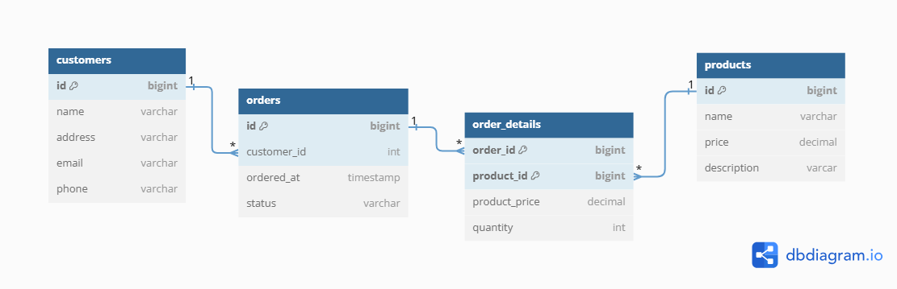
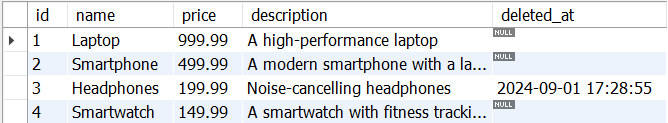

Please take a look at this relational schema:



That is a simple schema for storing order information in a store. One customer can have many orders, while one order belongs to one customer. Also, there is a many-to-many relationship between order and product, with the intermediate table being `order_details`.

Now, as an owner or administrator of the store, you have the ability to manage the products. You can create a new product, update an existing product, and delete a product. However, a problem will arise when you try to delete a product that has already been ordered. In other words, the product ID is being used in the product_id column (foreign key) in order_details. We can’t delete it because it violates the reference integrity constraint. This is an example of the message that we’ll get:

> Error Code: 1451. Cannot delete or update a parent row: a foreign key constraint fails (my_database.order_details, CONSTRAINT order_details_ibfk_2 FOREIGN KEY (product_id) REFERENCES products (id))

There are few solutions to overcome this problem. First, you should delete all the records in the `order_details` table that contain the product ID that will be deleted. That way, you can delete the product because no remaining product IDs are being used in that table. Second, you can add the ON DELETE CASCADE constraint to the product_id column (foreign key). So, whenever you delete the product, it will also delete all the order details records related to that product.

Based on the solutions above, of course, we don’t want them. It’s because they will ruin our order data by deleting the order details record. At this point, you can try to implement the **soft deletes**.

## What is Soft Delete?

Soft delete is a database technique that marks records as removed without actually removing them from the database. Instead of permanently erasing data, we used a flag or separate column to signal that a record has been “deleted” or is no longer active[^1]. With this technique, we can overcome the previous problem by maintaining reference integrity because the record still exists.

## Implementation

To add soft deletes to our table, we should make a new column that acts as a flag. We can choose between `is_deleted` with the boolean type or `deleted_at` with the timestamp type. The second one is more informational because it gives additional information about the time when it was deleted. Below is an example of soft deletes with timestamp type:

```sql
-- Data definition
CREATE TABLE products (
    id BIGINT PRIMARY KEY AUTO_INCREMENT,
    name VARCHAR(255),
    price DECIMAL(10, 2),
    description VARCHAR(255),
    deleted_at TIMESTAMP -- Add this
);
```

Now, whenever you want to delete the product, you must use UPDATE instead of DELETE:

```sql
UPDATE products SET deleted_at = NOW() WHERE id = 3;
```



## Pros and Cons

Besides maintaining the reference integrity, there are other advantages of using soft deletes. But, keep in mind that there are also disadvantages to using this technique. The following are the pros and cons of using soft deletes:

### Pros

1. **Easier to recover data**. We can easily recover data by updating the flag column to its previous state. For example, update the `deleted_at` column to be null again. This gives us a safe feeling when we accidentally delete the data.
2. **History tracking and audit**. This is beneficial for auditing or legal purposes because the deleted data remains accessible and can be examined or analyzed later.

### Cons

1. **High complexity**. The soft delete can increase the query complexity because we must add a filter only to include records with the deleted_at column null. If you don’t add the filter, you can expose the deleted records. Some application frameworks have already handled this issue, such as Laravel, with its eloquent[^2].
2. **Need more storage**. Because data is not physically deleted, the database size can continue to grow over time. This may result in higher storage needs and slower query performance, particularly for tables containing large volumes of data.
3. **Data leakage**. If access rights management or querying are not working properly, data that is no longer relevant or sensitive may still be accidentally accessed.

## Conclusion

Based on the discussion above, using soft deletes can solve our initial problem about reference integrity. This is because we do not actually delete data from the database. We can also more easily perform data recovery and audits. However, also pay attention to the existing cons. This all goes back to your business process.

## References

[^1]: https://bun.uptrace.dev/guide/soft-deletes.html
[^2]: https://laravel.com/docs/11.x/eloquent#soft-deleting
